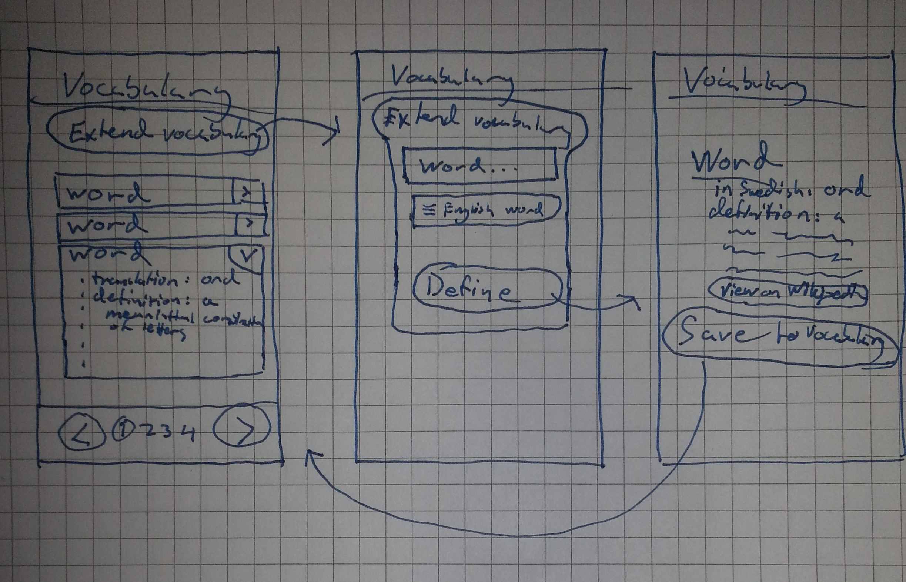

# Förberedelser inför tredje seminariet

## Projektidé

### Bakgrund

Jag har tagit för vana att så fort jag hör ett ord som jag inte förstår,
(oftast på engelska eller tyska, men även svenska ord) så skriver jag
upp det på en liten lista i mitt anteckningsblock. Sedan när jag får
tid så går jag igenom listan och skriver in orden i en tabell där jag
först kollar upp den svenska översättningen på [Google Translate](http://translate.google.com/) och sedan eventuellt letar upp definitionen på
ordet, oftast med Google Define eller Wiktionary, eventuellt även ytterligare en översättning till tyska eller spanska. De här listorna
skummar jag igenom ibland när jag har tråkigt för att träna/repetera
orden jag skrivit ner.

### Idé

Jag vet att det hade hjälpt mig själv väldigt mycket att ha en digital
ordlista som gjorde det här åt mig. Det finns redan gott om tjänster som
kan översätta och visa definitioner på ord, och även en hel del vokabulär-appar, men jag har inte hittat någon som fungerar riktigt på det sättet
som jag vill, dvs som både översätter och definierar ord på flera språk.

### Fördelar vs existerande alternativ

Den största "konkurrenten" är förmodligen <http://vocabulary.com>, som
verkar vara bra, men är väldigt inriktad på engelska, och inte anpassad
för mobilen.

Det jag vill fokusera på är **mobilanpassning** och **stöd för flera språk**. Jag vill att man ska anknyta de orden man slår upp till andra språk man kan eller vill lära sig, för att minska barriären mellan dem och kanske lära sig ytterligare ett ord på köpet. Det ska också vara möjligt
att lägga in egna definitioner/exempel.

## API:er

### Översättning

Google Translate kostar tyvärr pengar, men Google har en rysk kusin, Yandex, som
har en motsvarande tjänst utan kostnad. Det var lite av en utmaning att ta
sig förbi captchan med ryska bokstäver, men den verkar riktigt lovande! Det
behövs en API-nyckel som var gratis och verkar tämligen obegränsad, man får
snabba (och väldigt korta, i princip bara översättningen) svar tillbaka.

### Definitioner

Wikipedia/Wiktionary har gratis API som fungerar utan speciell nyckel, för alla
deras språk. Om jag har tid har jag också tänkt använda Urban Dictionarys API
för att ta hand om talspråk och slang, även detta verkar inte ha några speciella
begränsningar.

### Format

Tursamt nog så verkar alla API:er jag kollat på returnera JSON.

### Risker

Både Wikipedias och Urban Dictionarys API är i tidigt utvecklingsstadium, så det är
stor risk att gränssnittet ändras. Jag ska använda mig av polymorfism för att
göra det lätt att byta ut tjänster mot andra API:er om det behövs, och även göra det möjligt för användaren att lägga
in egna definitioner/översättningar om systemet inte svarar, eller om svaret inte
är till belåtelse.

## Fallstudie

Jag använder en Android-app som heter Bankdroid väldigt mycket, man kan lägga in
sina olika banker och så presenterar den saldo i en prydlig lista, man kan också
göra widgets som visar saldot på hemskärmen, och man får notifikationer när en
transaktion på någon av ens konton skett.

Det är en stor hjälp för mig som har många olika konton, och ofta bara vill se
saldot utan att faktiskt göra något - det är mycket smidigare än att logga in
på flera olika mobilbanker varje gång man vill se hur mycket pengar man har.

Dock så är säkerheten från bankerna ofta i vägen, jag vet att den skrapar informationen
från vissa av bankerna, och det är inte alltid det fungerar.
